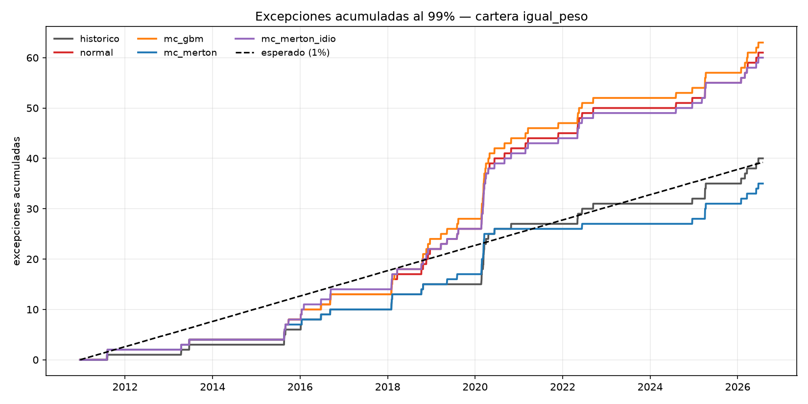
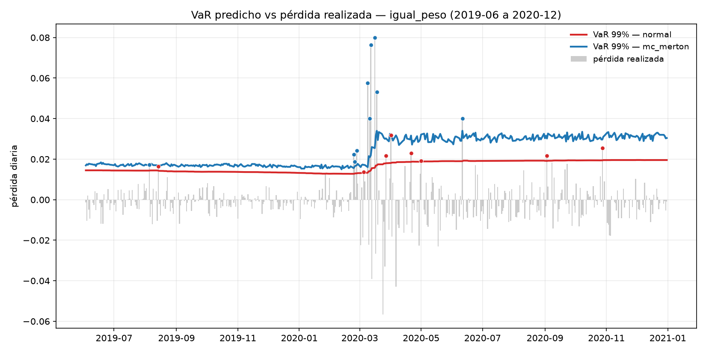
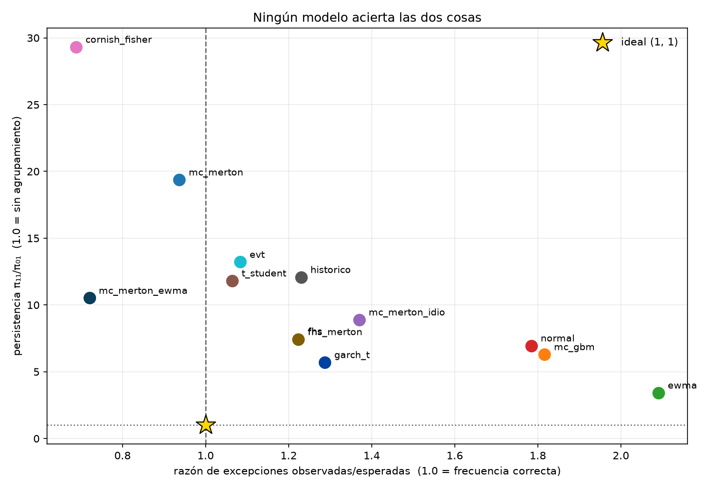
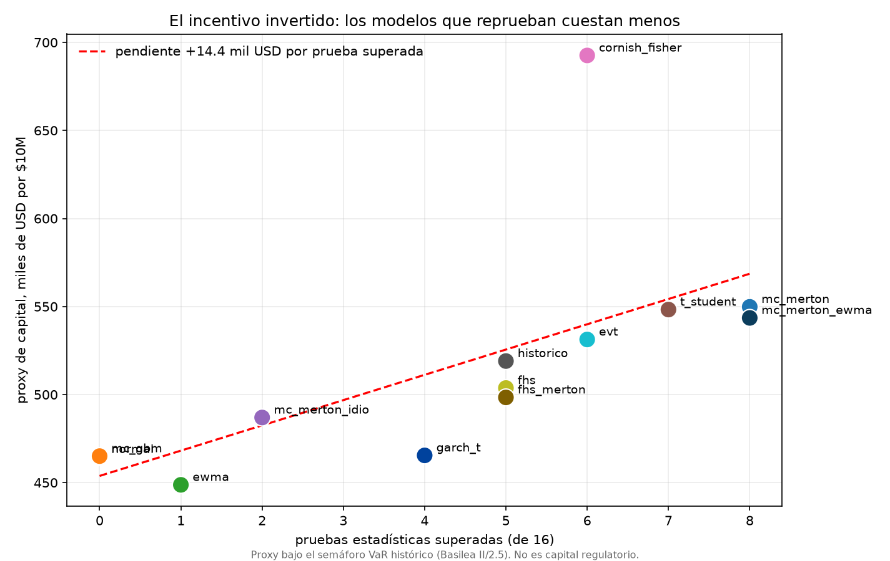

# Motor de asignación y riesgo con saltos

[](https://github.com/marcoreyess22/jump-risk-engine/actions/workflows/tests.yml)

*[English version](README.md) · [Guía técnica](docs/guia.html)*

## ¿Cuánto capital te cuesta el modelo de riesgo equivocado?

**Menos. Ese es el problema.**

Auditoría de **13 especificaciones de VaR/ES × 4 carteras** sobre 8 clases de activo y 3,923
días out-of-sample (2011-2026), con validación de Kupiec, Christoffersen, Acerbi-Székely y el
semáforo de capital de Basilea.

---

## Resultado

| | |
|---|---|
| **El VaR gaussiano produce 2.06× las excepciones esperadas** | Reprueba Kupiec, cobertura condicional y el backtest de ES en las 4 carteras |
| **El VaR con saltos produce 0.97×** | La mejor calibración de frecuencia de las trece |
| **39 de 40 combinaciones reprueban independencia** | Tras una excepción la probabilidad se multiplica por 16 |
| **Al 99% ningún modelo acierta los tres ejes — al 95% dos sí** | El veredicto al 99% era un artefacto de potencia: 39 excepciones esperadas no resuelven lo que 196 hacen evidente |
| **El modelo que reprueba todo cuesta 18.4% MENOS capital** | El castigo del semáforo no compensa lo que se ahorra subestimando |
| **Optimizar CVaR no redujo la cola realizada** | Asigna 10 pp distinto que mínima varianza, con +0.1% de CVaR |

**Recomendación — y depende del nivel, que es justamente el hallazgo.**

**Al 99%**, adoptar **`mc_merton`**. Es la única especificación que acierta a la vez la
frecuencia de las pérdidas extremas (0.94×, la mejor calibrada) y su magnitud (pasa el backtest
de Expected Shortfall en las 4 carteras) — y la magnitud es lo que mide el marco vigente, ya que
el IMA de FRTB se construye sobre Expected Shortfall y no sobre VaR. Sus excepciones siguen
apelmazándose en crisis, y a este nivel nada lo arregla.

**Al 95%**, adoptar **`fhs` o `garch_t`**. Ambas sacan 12 de 12: frecuencia, momento y magnitud,
en las cuatro carteras. Y `mc_merton` se desploma a 2 de 12, porque un modelo afinado para el 1%
extremo sobreestima el hombro de la distribución.

**Ningún modelo es correcto — lo son en un nivel.** Elegir especificación sin fijar antes el
nivel de confianza es elegir mal. Ver
[Acto 4](#acto-4--el-nivel-de-confianza-decidía-la-conclusión), que además muestra que el
veredicto anterior de "nada arregla el momento" era un artefacto de potencia estadística y no
una propiedad de los modelos.

Y no confiar en el semáforo de Basilea como único criterio de aprobación: sobre estos datos
**premia económicamente a los modelos que reprueba**. La conclusión práctica no es afinar el
modelo para pasar el test, sino que el test cuantitativo no basta.

---

## Método

**Datos.** 8 ETF (`SPY QQQ IWM EFA EEM TLT GLD DBC`), cierres ajustados, 2007-01-03 a
2026-07-30. 4,924 días sin huecos. Descarga única cacheada en `data/prices.csv`.

**Modelo.** Difusión con saltos de Merton sobre retornos logarítmicos diarios:

```
X = m + σ·Z + Σ_{i=1}^{N} Y_i        N ~ Poisson(λ),  Y_i ~ N(μ_J, σ_J²)
```

Calibrado por método de momentos: los cumulantes en forma cerrada se igualan a la varianza,
skew y kurtosis muestrales. La calibración reproduce los momentos empíricos a `rtol=1e-6`.

**Salto sistémico.** Un único proceso de Poisson compartido por los ocho activos, con tamaños
de salto correlacionados por la matriz empírica. Como λ es la misma en todos, compartir la
cuenta no altera ninguna marginal — se gana dependencia de cola sin recalibrar nada.

**Walk-forward.** Ventana rodante de 1,000 días. Los pesos se reoptimizan al cambiar de mes
(188 rebalanceos); el VaR se recalcula todos los días sobre los pesos vigentes. Reoptimizar a
diario invalidaría la medición: el VaR estaría midiendo una cartera que nunca existió un día
completo.

**Trece especificaciones.** Cinco incondicionales sin volatilidad variable (`historico`,
`normal`, `mc_gbm`, `mc_merton`, `mc_merton_idio`), tres con colas no gaussianas pero varianza
plana (`t_student`, `cornish_fisher`, `evt`) y dos con volatilidad condicional (`ewma`, `fhs`).
Todas se registran bajo una firma única `(retornos, pesos, nivel, rng) → (VaR, ES)`, de modo que
el bucle de backtest no conoce ningún modelo por nombre.

**Validación.** Kupiec (frecuencia), Christoffersen (independencia y cobertura condicional),
Acerbi-Székely Test 2 (Expected Shortfall) y el semáforo de capital de Basilea. Las pruebas de
cobertura se verificaron contra series sintéticas de respuesta conocida **antes** de aplicarlas
a los datos reales: Kupiec rechaza 9/100 bajo H₀ cierta y 100/100 con la tasa inflada;
Christoffersen rechaza 100/100 series apelmazadas con tasa incondicional correcta, donde Kupiec
solo rechaza 24/100.

El de Acerbi-Székely recibió el mismo tratamiento y **no lo pasó a la primera**: su distribución
nula se construía remuestreando los cocientes de cola observados, lo que la contaminaba con la
alternativa — con el ES un 50% subestimado rechazaba 4 de 100. El nulo se reconstruyó desde el
modelo (el exceso sobre el VaR como exponencial de media ES − VaR, la elección de máxima
entropía consistente con ese par) y ahora la potencia crece con la severidad: 1/60 bajo H₀,
12/60 con datos t(6) y 36/60 con t(3). **La corrección cambió veredictos**, y las tablas de
este informe son las posteriores.

---

## Acto 1 — el diagnóstico

*(Cinco especificaciones incondicionales. El Acto 2 amplía el conjunto y matiza la conclusión.)*

### 1. Los saltos corrigen la frecuencia de excepciones



| Modelo | Excepciones | Razón obs/esp | Kupiec |
|---|---|---|---|
| `normal` | 81 | **2.06×** | REPRUEBA |
| `mc_gbm` | 84 | **2.14×** | REPRUEBA |
| `historico` | 52 | 1.33× | pasa |
| `mc_merton` | 38 | **0.97×** | pasa |

*(cartera de mínima varianza; el patrón se repite en las cuatro — ver
[figura 3](figures/3_razon_excepciones.png))*

`normal` y `mc_gbm` caen a distancia de ruido de simulación (81 contra 84), como deben: son el
mismo supuesto por dos vías, una cerrada y otra por Monte Carlo. Que coincidan es una
verificación cruzada que no se diseñó.

### 2. Las colas idiosincrásicas se diversifican; las sistémicas no

Con saltos **independientes** entre activos, el cociente ES/VaR de la cartera es 1.159 —
indistinguible del gaussiano (1.162). Los choques independientes se promedian entre ocho
activos y la cola vuelve a ser normal. Solo el salto **sistémico** sobrevive a la agregación
(1.460).

Esto se refleja en el backtest: `mc_merton_idio` pasa Kupiec en las carteras concentradas y lo
reprueba en `risk_parity` e `igual_peso`, las dos más diversificadas.

**Consecuencia de diseño:** modelar colas gordas activo por activo no sirve para el riesgo de
una cartera. Lo que importa es si saltan juntos.

### 3. Acertar la frecuencia no es acertar el momento



**Las cinco especificaciones de este acto reprueban la prueba de independencia**, incluida la
que pasa Kupiec con 0.97×. Los diagnósticos:

```
π_01 = 0.0082      π_11 = 0.1351      →  16.4× tras una excepción

Excepciones por año:   2012: 0    2020: 10-16
                       2014: 0    2018:  5-12
                       2017: 0    2022:  4-5
```

Las cinco peores pérdidas del periodo son cuatro días de marzo de 2020 y el 8 de agosto de 2011.

No es un defecto de implementación: **ninguna de las cinco tiene volatilidad variable en el
tiempo** — todas usan una ventana plana de 1,000 días, así que estructuralmente no pueden
capturar agrupamiento. El veredicto es correcto y marca el límite del enfoque incondicional.

Ese límite es la pregunta que abre el Acto 2: **¿condicionar por volatilidad lo arregla?**

---

## Acto 2 — auditoría de las diez primeras especificaciones

Promedio sobre las 4 carteras. `pasa` cuenta pruebas superadas de 16 (4 carteras × Kupiec,
independencia, cobertura condicional y Acerbi-Székely).

| modelo | razón | persistencia | ES (de 4) | multiplicador | proxy de capital (k$/10M) | pasa (de 16) |
|---|---|---|---|---|---|---|
| `mc_merton` | **0.94** | 19.4 | **4** | 3.10 | 550 | **8** |
| `mc_merton_ewma` | 0.72 | **10.5** | **4** | **3.00** | 544 | **8** |
| `t_student` | 1.06 | 11.8 | 3 | 3.10 | 548 | 7 |
| `cornish_fisher` | 0.69 | 29.3 | **4** | 3.07 | 693 | 6 |
| `evt` | 1.08 | 13.2 | 2 | 3.12 | 531 | 6 |
| `historico` | 1.23 | 12.1 | 2 | 3.13 | 519 | 5 |
| `fhs` | 1.22 | 7.5 | 2 | 3.10 | 504 | 5 |
| `fhs_merton` | 1.22 | 7.4 | 1 | 3.09 | 498 | 5 |
| `mc_merton_idio` | 1.37 | 8.9 | 0 | 3.17 | 487 | 2 |
| `ewma` | 2.09 | **3.4** | 0 | 3.35 | 449 | 1 |
| `normal` | 1.78 | 7.0 | 0 | 3.23 | 465 | **0** |
| `mc_gbm` | 1.82 | 6.3 | 0 | 3.24 | 465 | **0** |

### Tres ejes, y ningún modelo acierta los tres



La pregunta del Acto 2 era si la volatilidad condicional arregla la falla de independencia del
Acto 1. La respuesta es parcial, y al validarla aparece un tercer eje que separa a los
candidatos de forma tajante:

| | Frecuencia | Momento | Magnitud (ES) | Mecanismo |
|---|---|---|---|---|
| `ewma` | **peor** (2.04×) | **mejor** (π 3.6) | 0/4 | vol condicional, colas gaussianas |
| `fhs` | buena (1.22×) | 2ª mejor (π 7.5) | 2/4 | escala condicional, forma empírica |
| `mc_merton` | **mejor** (0.96×) | casi el peor (π 20.4) | **4/4** | colas gordas, vol plana |

De 40 combinaciones, **una sola pasa independencia**: `igual_peso/ewma`, con p = 0.146. EWMA
reduce la persistencia a 3.6 pero falla la frecuencia porque sigue suponiendo normalidad: sabe
*cuándo* sube el riesgo y no *cuánta* cola tiene.

FHS parecía la síntesis —escala condicional de EWMA más forma empírica de la cola— y acierta la
frecuencia y el momento. Pero **falla la magnitud**: reprueba el backtest de ES en 2 de 4
carteras (p = 0.006 y 0.021). El mecanismo es coherente con su construcción: reescala residuos
históricos por la volatilidad vigente, así que un salto que golpea durante un tramo de calma se
mide con residuos estandarizados en calma y la severidad sale corta.

Merton es el inverso exacto: acierta cuánto y no cuándo. Como el IMA de FRTB se construye sobre
Expected Shortfall, **la magnitud pesa más que el momento** para la métrica que el marco
realmente usa, y por eso es la recomendación pese a su peor persistencia.

### El incentivo invertido



**Proxy** de capital = multiplicador medio × VaR medio × $10M de nocional, cartera de mínima
varianza. Es una vara de comparación bajo el semáforo VaR *histórico* de Basilea, **no** una
cifra de capital regulatorio — ver [Alcance y limitaciones](#alcance-y-limitaciones):

```
normal         $389,877   +0.0%   ← reprueba las cuatro pruebas
mc_gbm         $390,960   +0.3%   ← reprueba Kupiec, CC y ES
ewma           $393,288   +0.9%   ← reprueba Kupiec y ES
fhs            $427,270   +9.6%
mc_merton      $461,661  +18.4%   ← el mejor calibrado
mc_merton_ewma $482,938  +23.9%
cornish_fisher $530,557  +36.1%
```

**El modelo que reprueba todo es el más barato.** El mecanismo: el multiplicador castiga como
máximo +33% (3.00 → 4.00), mientras que subestimar el VaR ahorra ~20% de forma directa. Y el
castigo efectivo queda muy por debajo del tope: con el doble de la tasa de excepciones, un
modelo promedia 5.2 excepciones por ventana de 250 días — apenas la primera banda amarilla. **El
semáforo tiene poca potencia en ventanas de 250 días.**

Esto no es un artefacto del cálculo: es la crítica documentada al marco de backtesting de
Basilea, y una de las razones por las que FRTB trasladó la métrica de capital del IMA de VaR a
Expected Shortfall y conserva atribución de P&L y requisitos cualitativos de aprobación además
del test cuantitativo.

*La hipótesis original de este proyecto era que reprobar el backtest encarecería el capital.
Resultó incorrecta en el signo. Se reporta como salió.*

---

## Acto 3 — cerrar el hueco que el proyecto dejó abierto

El Acto 2 terminaba señalando una extensión concreta y no construida: *acoplar las marginales
de Merton a una escala condicional tipo EWMA*. Ya están en el registro, por dos vías.

**¿Le queda algo a Merton por modelar tras EWMA?** Estandarizar cada activo por su propia
volatilidad EWMA absorbe entre el **63% y el 90%** del exceso de kurtosis: la mayor parte de
las colas gordas diarias viene del agrupamiento de volatilidad, no de saltos. Pero sobrevive un
exceso medio de 2.06, y ese residuo es lo que ajusta el componente de saltos. Si hubiera sido
cero, el modelo habría colapsado a `ewma`.

**`mc_merton_ewma`** estandariza por activo, calibra Merton sobre los residuos, genera
escenarios conjuntos con el salto sistémico y reescala por la volatilidad de mañana. Es un
modelo de correlación condicional constante con innovaciones de Merton.

**`fhs_merton`** hace lo mismo directamente sobre la serie de la cartera, evitando el supuesto
CCC — a costa de perder el salto sistémico, porque ya no hay activos que acoplar.

| | frecuencia | momento | magnitud | total |
|---|---|---|---|---|
| `mc_merton` | **0.94** (Kupiec 4/4) | 19.4 | **ES 4/4** | 8/16 |
| `mc_merton_ewma` | 0.72 (Kupiec 2/4) | **10.5** | **ES 4/4** | 8/16 |
| `fhs_merton` | 1.22 | 7.4 | ES 1/4 | 5/16 |

**El hueco se estrechó; no se cerró.** `mc_merton_ewma` es la única especificación que combina
un ES perfecto con algún acierto de independencia, reduce el agrupamiento a la mitad
(19.4 → 10.5) y carga el multiplicador de capital más bajo de las doce (3.00 — todas las
ventanas en verde). Pero lo compró volviéndose sistemáticamente conservadora: 0.72× donde
Merton está en 0.94×. Cambió un sesgo por otro, y 10.5 sigue a un orden de magnitud del 1.0 que
la independencia exige.

**`fhs_merton` es un resultado negativo limpio.** Sustituir el remuestreo empírico de FHS por
una cola paramétrica lo empeoró: el ES cae de 2/4 a 1/4. El mecanismo se ve en las pruebas — la
cola paramétrica llega a −10σ cuando el peor residuo observado es −5.14σ. Esa capacidad de
generar lo nunca visto ayuda en la construcción multivariada y sobredispara en la univariada.
La distribución empírica de residuos hacía mejor trabajo que el ajuste paramétrico. Se queda en
el registro, documentado, en lugar de desaparecer sin ruido.

---

## Acto 4 — el nivel de confianza decidía la conclusión

El Acto 3 cerró con que el hueco *se estrechó pero no se cerró*: ningún modelo acertaba
frecuencia, momento y magnitud a la vez. Esa conclusión resultó ser **un artefacto de potencia
estadística**, no un hallazgo sobre los modelos.

Al 99% hay ~39 excepciones esperadas en 3,923 días. Al 95% hay **196 — cinco veces más**. Correr
el mismo backtest a ese nivel no cambia ningún modelo; cambia lo que los tests pueden ver.

| | 99% | 95% |
|---|---|---|
| Ancho medio del IC bootstrap de la razón | 0.94 | **0.38** |
| Independencia: modelos **condicionales** | 2 de 20 | **18 de 20** |
| Independencia: modelos **incondicionales** | 0 de 32 | **0 de 32** |
| Persistencia de los condicionales | 3.4 – 10.5 | **1.3 – 1.4** |
| Persistencia de los incondicionales | 6.3 – 29.3 | 2.5 – 2.7 |

La separación al 95% es total: **pasan independencia los cinco modelos con volatilidad
condicional y ninguno de los ocho sin ella.** Y su persistencia cae a 1.3, que es esencialmente
1.0 — agrupamiento eliminado.

La pregunta que abría el Acto 2 —*¿condicionar por volatilidad arregla la independencia?*— tiene
respuesta inequívoca. Al 99% el test simplemente no tenía potencia para verla.

**Dos modelos aciertan los tres ejes al 95%:** `fhs` y `garch_t`, ambos 12 de 12 sobre las
cuatro carteras. Y el orden se invierte respecto al 99%: `mc_merton`, el mejor calibrado en la
cola extrema, cae a 2 de 12 porque sobreestima el hombro de la distribución.

**Ningún modelo es correcto: lo son en un nivel u otro.** Merton describe bien el 1% extremo y
mal el 5%; los condicionales, al revés. Elegir modelo sin fijar antes el nivel es elegir mal.

### GARCH(1,1)-t

El proyecto había excluido GARCH por costo — reajustarlo son ~15,700 estimaciones. Se resolvió
resolviendo la recursión de varianza con un **filtro IIR** en lugar de un bucle: la recursión es
exactamente un filtro de un polo y `lfilter` la evalúa en C. De 51 ms por ajuste a 3.5 ms, y de
9.7 minutos a 1.2 en todo el walk-forward.

Frente a EWMA, la persistencia se **estima** en vez de fijarse en 0.94, y las colas son t en vez
de gaussianas — que era lo que hundía a `ewma` en frecuencia (2.09×) pese a su buen
comportamiento temporal. `garch_t` da 1.02× al 95% con 12 de 12.

Está implementado a mano en lugar de añadir una dependencia, lo que obliga a demostrar que
funciona: se valida por **recuperación de parámetros** sobre series simuladas desde valores
conocidos (persistencia 0.970 → 0.964).

### Costos de transacción

Medidos como media suma de |Δw| en el día de rebalanceo, sobre 15.6 años:

| cartera | rotación anual | bruto | neto 10 pb | CVaR |
|---|---|---|---|---|
| `min_cvar` | **93.6%** | 7.13% | 7.03% | 2.11% |
| `min_var` | 18.4% | 6.97% | 6.95% | 2.08% |
| `risk_parity` | 5.7% | 6.79% | 6.79% | 2.36% |
| `igual_peso` | 0.0% | 7.67% | 7.67% | 3.24% |

**El resultado negativo se refuerza.** `min_cvar` rota cinco veces más que `min_var`, cuesta 10
pb anuales frente a 2, y su ventaja bruta de retorno (+0.16 pp) se evapora a **+0.01 pp** con 20
pb — mientras sigue entregando 1.6% *peor* CVaR realizado. Optimizar la cola no solo no pagó:
además cuesta más de operar.

---

## El resultado negativo

**Optimizar CVaR no redujo el riesgo de cola realizado.**

| | ret_anual | vol_anual | sharpe | VaR99 | CVaR99 | peor_día | max_dd |
|---|---|---|---|---|---|---|---|
| `min_cvar` | 7.07% | 9.03% | 0.783 | 1.52% | 2.08% | **4.55%** | 23.75% |
| `min_var` | 6.97% | 8.72% | **0.799** | 1.52% | 2.08% | 5.02% | **22.67%** |
| `risk_parity` | 6.79% | 9.47% | 0.717 | 1.63% | 2.36% | 5.55% | 23.89% |
| `igual_peso` | 7.67% | 12.61% | 0.608 | 2.20% | 3.24% | 7.99% | 25.04% |

CVaR realizado: **+0.1%**. Máximo drawdown: **+4.8% peor**. Sharpe: ligeramente menor. La única
métrica donde gana es el peor día individual (−9.3%).

**No es que los optimizadores coincidan.** Verifiqué que las carteras son genuinamente
distintas: la diferencia de pesos es de 10 puntos porcentuales, contra una dispersión entre
semillas de simulación de 1.8 pp — señal real, 5.5× por encima del ruido. El optimizador de
CVaR hace algo distinto; simplemente no paga.

La lectura más plausible es error de estimación. CVaR al 99% se ajusta al 1% extremo de una
distribución que a su vez se estimó con 1,000 días. Al bajar a β=0.95 —donde la cola tiene
cinco veces más datos— la diferencia de pesos cae de 10 pp a 3 pp. La discrepancia vive
justamente donde los datos son más escasos.

*Esto se reporta como salió. Una hipótesis previa mía —que la construcción con salto sistémico
volvía la distribución conjunta elíptica y por eso las soluciones coincidían— resultó
incorrecta al contrastarla, y quedó descartada.*

---

## Limitaciones declaradas

- **λ no está identificada** por los momentos 2 a 4: son 5 parámetros contra 4 ecuaciones.
  Se fija en 0.05/día (12.6 saltos/año) como decisión de modelado declarada, con sensibilidad
  reportada en `merton.sensibilidad_lambda`. Cerrarla exigiría el sexto cumulante muestral, que
  es ruido.
- **Los costos de transacción ya están medidos** (Acto 4), pero solo como cargo lineal sobre la
  rotación. Impacto de mercado, asimetría bid-ask y costos de préstamo no se modelan.
- **GARCH no está incluido.** Reajustarlo dentro del walk-forward son ~3,900 estimaciones
  diarias por activo con sus fallos de convergencia. EWMA es su primo no estimado y captura la
  mayor parte del agrupamiento; FHS lo usa como filtro. Es la extensión natural.
- **Sin dependencia de cola asimétrica.** El salto sistémico acopla a los ocho activos con la
  misma intensidad. Cargas de salto distintas por activo darían una estructura más rica —
  y es el candidato más probable a que la optimización de CVaR sí pague.
- **Solo posiciones largas**, `sum(w)=1, w≥0`.
- **Un solo nivel de confianza** (99%) en el backtest principal.
- **Calibración por momentos, no por máxima verosimilitud.** El MLE de Merton tiene una
  verosimilitud no acotada conocida; se prefirió el estimador robusto.

---

## Alcance y limitaciones

**Qué es.** Un estudio comparativo de especificaciones VaR/ES y reglas de asignación de
cartera, validado fuera de muestra. Su propósito es metodológico: medir cuánto cambia el riesgo
medido según el modelo elegido, y probar cada estadístico antes de confiar en él.

**Qué no es.** No estima capital regulatorio de ninguna institución. El semáforo reproducido en
`src/basel.py` es la tabla **histórica** de backtesting sobre VaR (Basilea II / 2.5), usada aquí
solo como vara de comparación, y por eso toda cifra monetaria se llama `capital_proxy`. El marco
vigente difiere en aspectos que este proyecto no implementa:

- El IMA de FRTB calcula capital con **Expected Shortfall al 97.5%**, con escalado por horizonte
  de liquidez y calibración a periodo estresado — no con VaR a un día.
- El backtesting de VaR a un día sigue vigente bajo FRTB, pero a nivel de *mesa* y acompañado de
  pruebas de **atribución de P&L** que comparan P&L teórico-de-riesgo contra hipotético. No
  implementado aquí.
- Factores de riesgo no modelizables, el piso del método estándar y los recargos supervisores
  quedan fuera de alcance.

Fuentes primarias: [MAR32 — backtesting and P&L attribution](https://www.bis.org/basel_framework/chapter/MAR/32.htm)
· [BCBS d457 — Minimum capital requirements for market risk](https://www.bis.org/bcbs/publ/d457.htm)

**Limitaciones estadísticas que permanecen.** Los intervalos bootstrap de la razón de
excepciones se solapan mucho entre los modelos supervivientes (`mc_merton` [0.59, 1.43] contra
`fhs` [0.87, 1.76] en `min_var`): los datos separan a la familia gaussiana del resto, pero **no
ordenan a los supervivientes**. El orden puntual de las tablas anteriores es un resumen, no un
resultado significativo. Corre `make scorecard` para ver los intervalos.

**λ hace trabajo real en la recomendación.** La rejilla de sensibilidad acotada
(`make sensitivity`, 3 λ × 3 ventanas sobre `min_var`) muestra que el orden gaussiano-contra-
saltos es robusto: `normal` nunca es mejor que 1.85 y `mc_merton` nunca peor que 1.82. Pero la
*ventaja* de `mc_merton` no lo es: con λ = 0.02 su razón es 1.51–1.82, **por detrás de `fhs` e
`historico`**. La elección declarada de λ = 0.05 resulta ser la mejor calibrada, y λ es
justamente el parámetro que los momentos 2-4 no identifican. La recomendación debe leerse como
condicional a esa elección de modelado, no como un ranking dictado por los datos.

**El contrafactual idiosincrático no es limpio.** Con saltos independientes, D = Σ − J no es
semidefinida positiva y hay que proyectarla, lo que distorsiona la covarianza objetivo un ~19%
(~28% en correlación). `mc_merton_idio` es un diagnóstico de diversificación de colas, no una
atribución causal. Corre `make report` para verlo.

## Referencias

- Merton, R. C. (1976). *Option pricing when underlying stock returns are discontinuous.*
  Journal of Financial Economics 3(1–2), 125–144.
- Rockafellar, R. T., & Uryasev, S. (2000). *Optimization of Conditional Value-at-Risk.*
  Journal of Risk 2(3), 21–41.
- Kupiec, P. (1995). *Techniques for verifying the accuracy of risk measurement models.*
  Journal of Derivatives 3(2), 73–84.
- Christoffersen, P. (1998). *Evaluating interval forecasts.* International Economic Review
  39(4), 841–862.
- Acerbi, C., & Székely, B. (2014). *Backtesting Expected Shortfall.* Risk Magazine.
- Maillard, S., Roncalli, T., & Teïletche, J. (2010). *The properties of equally weighted risk
  contribution portfolios.* Journal of Portfolio Management 36(4), 60–70.
- Basel Committee on Banking Supervision. *MAR32 — Internal models approach: backtesting and
  P&L attribution.* https://www.bis.org/basel_framework/chapter/MAR/32.htm
- Basel Committee on Banking Supervision (2019). *Minimum capital requirements for market
  risk* (d457). https://www.bis.org/bcbs/publ/d457.htm

---

## Reproducir

```bash
pip install -e ".[data]"       # sin [data] corre 100% offline desde el CSV cacheado
python tests/test_core.py      # 25 checks de validación, ~4 min
python -m src.backtest         # walk-forward, 13 modelos × 4 carteras, ~14 min
python -m src.basel            # semáforo de capital y backtest de ES
python -m src.plots            # figuras
python -m src.diario --sembrar # corrida diaria con estado (modo sombra)
```

`tests/test_core.py` contiene el criterio de validación de cada fase. Los cuatro que más
importan:

1. **La calibración reproduce los cumulantes en forma cerrada** (`rtol=1e-6`), sin ruido de
   simulación — aísla la calibración del simulador.
2. **El `α` del programa lineal converge al VaR empírico**: 0.015208 contra 0.015208. El LP
   nunca ve un percentil; si hubiera un error de signo o escala, saltaría aquí.
3. **Bajo escenarios gaussianos centrados, mín-CVaR converge a mínima varianza** (máx|Δw| =
   0.0022) — la equivalencia teórica que valida la formulación de Rockafellar-Uryasev.
4. **Las pruebas de cobertura se validan contra series sintéticas** antes de usarse.

## Estructura

```
src/data.py       ingesta y caché
src/merton.py     calibración, cumulantes, simulación, escenarios conjuntos
src/optimize.py   mín-CVaR (LP), Markowitz (QP), risk parity
src/risk.py       registro de los 13 modelos VaR/ES con firma única
src/backtest.py   walk-forward, Kupiec, Christoffersen
src/basel.py      semáforo de capital y Acerbi-Székely
src/diario.py     corrida diaria con estado persistente
src/plots.py      figuras
```

## Hipótesis descartadas

Tres conjeturas propias que los datos refutaron, documentadas porque probar y descartar es
parte del trabajo:

| Hipótesis | Qué dijeron los datos |
|---|---|
| El salto sistémico vuelve elíptica la distribución conjunta, y por eso mín-CVaR coincide con mínima varianza | Falso: el caso de mezcla pura dio la **mayor** diferencia de pesos, no la menor |
| Mín-CVaR reduce la cola realizada frente a media-varianza | Falso: +0.1% de CVaR y 4.8% peor drawdown, pese a asignar 10 pp distinto |
| Reprobar el backtest encarece el proxy de capital | **Invertido**: el modelo que reprueba las cuatro pruebas cuesta 18.4% menos |
